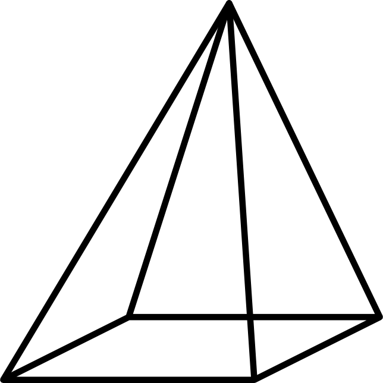

# Pyramid

Generate tiles pyramid for an image.



## Introduction

Two options came to my mind when starting this challenge:

- [ImageMagick](https://imagemagick.org) that I have used before to prepare datasets to feed to image classifier.
- [gdal2tiles](https://gdal.org/programs/gdal2tiles.html), a popular utility from the [gdal library](https://gdal.org/) to create raster pyramids

The command `gdal2tiles.py -p raster <image>` creates a 256x256 pyramid following the OSGeo Tile Map Service Specification, which is the opposite of the projection expected (x,y origin in the bottom left corner instead of top left).

On the other hand, I have found a couple of packages on NPM that acheived a similar result using ImageMagick and decided to use the same aproach as [image-tiler](https://www.npmjs.com/package/image-tiler) which is essentially a node wrapper around imagemagick's convert command. The package is actually broken because of the [mkdirp-promise](https://www.npmjs.com/package/mkdirp-promise) dependency so I have written my own in typescript.

Finally, I am using the popular [commander](https://github.com/tj/commander.js#readme) package to wrap the result in a cli. I have also added a couple of tests with [jest](https://jestjs.io/). With more time, I would aim for 100% code coverage.

## Installation

This assumes that Node.js has already been installed.

```shell
npm update @geopan.io/pyramid -g
```

### Dependencies

This tool depends on the [ImageMagick library](https://imagemagick.org/script/download.php)

#### Mac

```shell
brew install imagemagick
```

#### Linux / Ubuntu

```shell
sudo apt install imagemagick
```

## Usage

```shell
pyramid <image>
```

#### Help

```shell
pyramid -h

# Return

Usage: pyramid [options] <image>

Create a pyramid of tiles from an image

Options:
  -V, --version              output the version number
  -p, --pattern <pattern>    output pattern. Default is {z}/{x}_{y}.{format}
  -o, --output <output>      destination folder. Default is ./{image}_tiles
  -q, --quality <quality>    compression level. Default is 100
  -t, --tilesize <tilesize>  tile size. Default is 256px
  -h, --help                 display help for command
```
